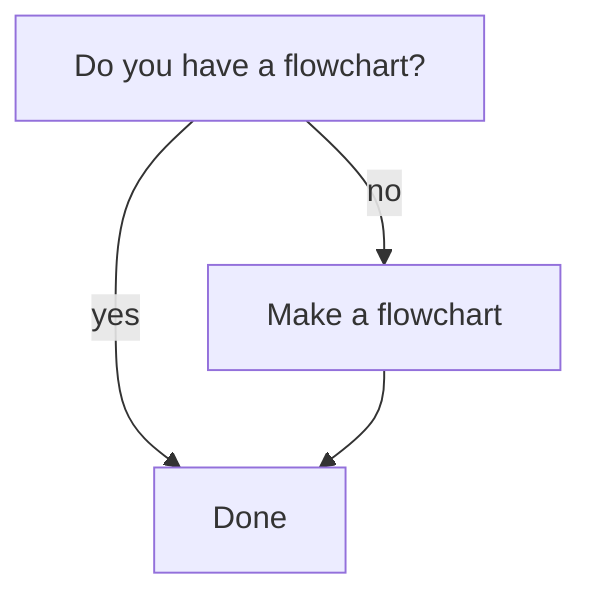

```cpp
#include <iostream> 

int main(int argc, char** argv)
{
    std::cout << "Github go brrrrrrrr...." std::endl;

    return 0;
}
```


```mermaid
flowchart TD

    a[Do you have a flowchart?] -- yes --> b[Done]

    a -- no --> c[Make a flowchart]

    c --> b


```


{: .center}
